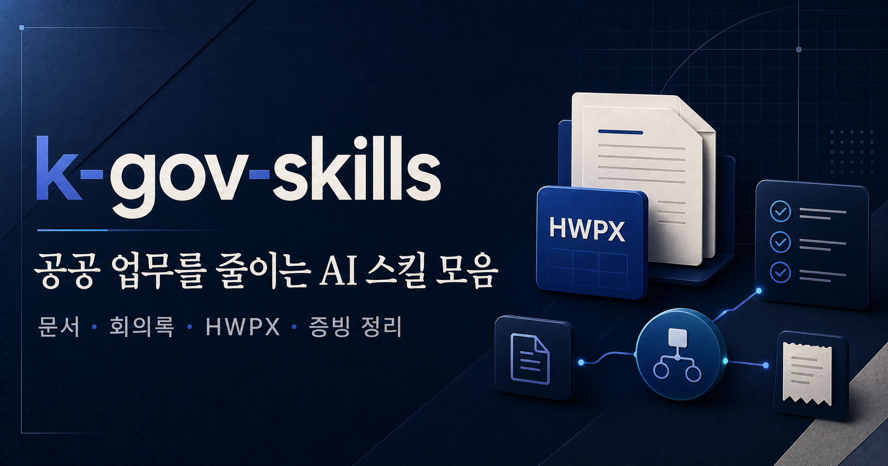

# k-gov-skills



공공기관에서 문서, 회의록, 근거조사, HWPX 양식 때문에 시간을 많이 쓰나요? 이 스킬 모음집을 받아 두세요. 언젠가 **반드시** 쓸 일이 옵니다.

보고서 초안, 정책 근거조사, 회의록 PDF, HWPX 양식 채우기, 출장 증빙 정리처럼 공공 실무에서 반복되는 귀찮은 일을 AI 에이전트에게 맡기기 위한 스킬 모음입니다.

`k-gov-skills`는 [`NomaDamas/k-skill`](https://github.com/NomaDamas/k-skill)의 스킬 구조와 문서화 방식을 참고했습니다. 다만 방향은 조금 다릅니다. `k-skill`이 한국 생활·업무 전반의 자동화 모음이라면, `k-gov-skills`는 **공무원·공공기관 문서 업무**에 초점을 둡니다.

## 외부 원본 사용 고지

`read-hwp`, `korean-law-search`, `kosis-stats` 등 일부 스킬은 `NomaDamas/k-skill` 계열 원본을 공공기관 문서·법령·공식통계 근거조사에 필요해 가져온 뒤, 공개 배포와 k-gov 업무 흐름에 맞게 **일부만 가공한 파생·적응본**입니다.

해당 스킬들은 이 저장소의 순수 창작 스킬로 표시하지 않습니다. 원 출처, 원 저작자, `kordoc`, `korean-law-mcp`, KOSIS Open API, 법제처 Open API, 법망 등 사용 도구·서비스의 권리와 이용 조건을 존중합니다. 자세한 출처와 수정 범위는 [`docs/attribution.md`](docs/attribution.md)에 따로 기록했습니다.

핵심은 단순 자동화가 아닙니다.

**양식은 지키고, 작성 흐름은 줄이고, 결과물은 사람이 바로 검토할 수 있게 만드는 것**입니다.

## 🚨 에이전트에 던지기 전에 하나만 더요

이 저장소는 공개 배포를 전제로 다듬는 중입니다.

공공문서는 작은 예시 하나에도 기관명, 개인명, 내부 경로, 비공개 양식이 섞이기 쉽습니다. 새 스킬이나 예시 파일을 추가할 때는 먼저 `docs/security-and-secrets.md`를 확인하세요.

## 어떤 걸 할 수 있나

| 할 수 있는 일 | 스킬 이름 | 설명 | 사용자 로그인/자료 | 문서 |
| --- | --- | --- | --- | --- |
| 공공 보고서 작성 | `official-report-skillset` | 검토보고·계획보고·결과보고·간부보고 초안을 공공기관 문체와 의사결정 구조로 정리 | 불필요 | [공공 보고서 작성 가이드](docs/features/official-report-skillset.md) |
| 정책·제도 심층조사 | `deep-research-pro` | 법령·지침·공식자료·통계·사례를 출처와 함께 조사해 보고서 근거 메모 작성 | 불필요(비공개 자료는 사용자 제공 필요) | [심층 리서치 가이드](docs/features/deep-research-pro.md) |
| HWPX 보고서 생성 | `hwpx-mouseco` | 공개 배포용 HWPX 템플릿을 분석하고 원페이퍼·다중페이퍼·장문 보고서 생성·검증 | 템플릿/보고서 JSON 필요 | [HWPX 보고서 생성 가이드](docs/features/hwpx-mouseco.md) |
| 회의록 PDF 작성 | `gov-meeting-minutes` | 회의 메모·ClovaNote 전사를 1쪽 회의록과 상세 발언록이 포함된 공문서형 PDF로 정리 | 회의 메모/전사 필요 | [회의록 PDF 작성 가이드](docs/features/gov-meeting-minutes.md) |
| 교통비 증빙 수집 | `transport-receipt-collector` | 출장·여비 정산용 하이패스·SRT·KTX/Korail 영수증을 PDF/PNG/JSON 산출물로 정리 | provider별 로컬 계정 정보 필요 | [교통비 증빙 수집 가이드](docs/features/transport-receipt-collector.md) |
| ALIO 기관별 공시 상세 확인 | `alio` | ALIO 기관별 공시에서 공공기관별 일반현황·임직원·임원·재무·주요사업 등 상세 공시를 확인해 근거 메모로 정리 | 불필요 | [ALIO 기관별 공시 상세 확인 가이드](docs/features/alio.md) |
| HWP/HWPX 문서 읽기·변환 | `read-hwp` | HWP/HWPX/HWPML 문서를 Markdown/JSON으로 변환해 ALIO 내부규정·공시 첨부문서를 읽고 조항을 확인 | 문서 파일 필요 | [HWP/HWPX 문서 읽기·변환 가이드](docs/features/read-hwp.md) |
| 한국 법령 검색 | `korean-law-search` | 국가법령정보센터/법제처 API 계열과 korean-law-mcp로 법령·조문·판례·해석례·자치법규를 확인 | 필요 시 법제처 API key | [한국 법령 검색 가이드](docs/features/korean-law-search.md) |
| KOSIS 공식 통계 조회 | `kosis-stats` | KOSIS Open API로 공식 통계표를 검색·조회하고 공공기관용 지표 프리셋으로 정책·사업 근거 수치를 정리 | proxy 또는 KOSIS API key | [KOSIS 공식 통계 조회 가이드](docs/features/kosis-stats.md) |
| 공공데이터포털 데이터셋 검색 | `public-data-finder` | 공공데이터포털 목록개방현황 API로 공공기관 개방 데이터셋과 오픈API 후보를 검색 | 공공데이터포털 API key | [공공데이터포털 데이터셋 검색 가이드](docs/features/public-data-finder.md) |

## 처음 시작하는 순서

1. 필요한 스킬을 `skills/<skill-name>` 단위로 설치합니다.
2. 새 세션에서 스킬이 인식되는지 확인합니다.
3. 각 기능 문서를 열어 입력값, 예시, 제한사항을 확인합니다.
4. HWPX·회의록·영수증처럼 파일을 만드는 스킬은 결과 파일을 실제로 열어 검증합니다.
5. 공개 저장소에 올릴 예시나 템플릿은 민감정보 검사를 먼저 통과시킵니다.

설치 예시:

```text
$skill-installer install https://github.com/mouseco/k-gov-skills/tree/main/skills/official-report-skillset
$skill-installer install https://github.com/mouseco/k-gov-skills/tree/main/skills/deep-research-pro
$skill-installer install https://github.com/mouseco/k-gov-skills/tree/main/skills/hwpx-mouseco
$skill-installer install https://github.com/mouseco/k-gov-skills/tree/main/skills/gov-meeting-minutes
$skill-installer install https://github.com/mouseco/k-gov-skills/tree/main/skills/transport-receipt-collector
$skill-installer install https://github.com/mouseco/k-gov-skills/tree/main/skills/alio
$skill-installer install https://github.com/mouseco/k-gov-skills/tree/main/skills/read-hwp
$skill-installer install https://github.com/mouseco/k-gov-skills/tree/main/skills/korean-law-search
$skill-installer install https://github.com/mouseco/k-gov-skills/tree/main/skills/kosis-stats
$skill-installer install https://github.com/mouseco/k-gov-skills/tree/main/skills/public-data-finder
```

## 문서

| 문서 | 설명 |
| --- | --- |
| [새 스킬 추가 기준](docs/adding-a-skill.md) | `SKILL.md`, feature 문서, 예시 파일 작성 기준 |
| [보안/시크릿 정책](docs/security-and-secrets.md) | 공공문서·개인정보·계정정보·비공개 양식 취급 기준 |
| [출처/파생 기록](docs/attribution.md) | 외부 스킬에서 가져온 부분과 수정 범위 |
| [공공 보고서 작성 가이드](docs/features/official-report-skillset.md) | 공문서·검토보고·계획보고 초안 작성 |
| [심층 리서치 가이드](docs/features/deep-research-pro.md) | 출처 있는 정책·제도·통계 조사 |
| [HWPX 보고서 생성 가이드](docs/features/hwpx-mouseco.md) | HWPX 템플릿 분석·생성·검증 |
| [회의록 PDF 작성 가이드](docs/features/gov-meeting-minutes.md) | 회의록 요약본과 상세 발언록 생성 |
| [교통비 증빙 수집 가이드](docs/features/transport-receipt-collector.md) | 하이패스 영수증 PDF/PNG 저장 |
| [ALIO 기관별 공시 상세 확인 가이드](docs/features/alio.md) | 공공기관별 경영공시 상세내용 확인 |
| [HWP/HWPX 문서 읽기·변환 가이드](docs/features/read-hwp.md) | HWP/HWPX/HWPML 문서 변환과 조항 확인 |
| [한국 법령 검색 가이드](docs/features/korean-law-search.md) | 법령·조문·판례·해석례·자치법규 조회 |
| [KOSIS 공식 통계 조회 가이드](docs/features/kosis-stats.md) | 공공기관 보고서·정책근거용 공식 통계 조회 |
| [공공데이터포털 데이터셋 검색 가이드](docs/features/public-data-finder.md) | 공공기관 개방 데이터셋·오픈API 후보 검색 |

## 포함된 기능

- [공공 보고서 작성](docs/features/official-report-skillset.md)
- [정책·제도 심층조사](docs/features/deep-research-pro.md)
- [HWPX 보고서 생성](docs/features/hwpx-mouseco.md)
- [회의록 PDF 작성](docs/features/gov-meeting-minutes.md)
- [교통비 증빙 수집](docs/features/transport-receipt-collector.md)
- [ALIO 기관별 공시 상세 확인](docs/features/alio.md)
- [HWP/HWPX 문서 읽기·변환](docs/features/read-hwp.md)
- [한국 법령 검색](docs/features/korean-law-search.md)
- [KOSIS 공식 통계 조회](docs/features/kosis-stats.md)
- [공공데이터포털 데이터셋 검색](docs/features/public-data-finder.md)

## 저장소 구조

```text
docs/
  adding-a-skill.md          새 스킬 추가 표준
  security-and-secrets.md    공개자료·시크릿 취급 기준
  attribution.md             외부·파생 스킬 출처 기록
  features/                  스킬별 사용자·유지보수 문서
scripts/
  validate_skills.py         메타데이터·문서·JSON·Python·HWPX 검증
skills/
  official-report-skillset/  공공기관 보고서 작성 규칙
  deep-research-pro/         심층 리서치 절차와 보조 스크립트
  hwpx-mouseco/              HWPX 분석·생성·검증 도구와 배포용 템플릿
  gov-meeting-minutes/       회의록 PDF 생성 규칙과 렌더링 스크립트
  transport-receipt-collector/ 교통비 영수증 수집 스크립트
  alio/                    ALIO 기관별 공시 상세내용 확인 기준
  read-hwp/                HWP/HWPX/HWPML 문서 읽기·변환 기준
  korean-law-search/       한국 법령·조문·판례·해석례 조회 기준
  kosis-stats/             KOSIS 공식 통계 조회와 공공기관용 지표 프리셋
  public-data-finder/      공공데이터포털 개방 데이터셋 검색
```

## 공개 배포 기준

이 저장소에는 공개 가능한 자료만 둡니다.

- 실제 기관 내부 양식, 직인, 서명, 개인정보가 들어간 HWPX는 커밋하지 않습니다.
- 생성 결과물, 임시 압축 해제 폴더, 테스트 산출물은 커밋하지 않습니다.
- 공개 배포용으로 정리된 템플릿과 예시만 포함합니다.
- 리서치 스킬의 다운로드 원문 PDF나 비공개 자료는 커밋하지 않습니다.
- 계정 ID, 계정 비밀값, 인증번호, 내부 경로는 문서와 로그에 남기지 않습니다.

## 검증

현재 스킬 모음은 아래 명령으로 검증합니다.

```powershell
python -X utf8 scripts\validate_skills.py
```

검증 범위:

- `SKILL.md` frontmatter 표준 확인
- 스킬명과 폴더명 일치 확인
- 스킬별 `docs/features/<skill-name>.md` 존재 확인
- JSON 파싱 확인
- Python 스크립트 컴파일 확인
- HWPX 템플릿 ZIP/XML 구조 확인
- 공개 저장소에 부적절한 민감 문자열 기본 검색

## 이 저장소의 방향

`k-gov-skills`는 한국 공무원·공공기관 실무자가 “칼퇴하고 싶으면 이건 써야지”라고 느낄 만한 스킬을 하나씩 모으고, 실제 업무 흐름에 맞춰 다듬어 올리는 저장소입니다.

시작점은 공공문서입니다. 보고서, 회의록, HWPX 양식, 근거조사처럼 시간이 많이 드는 문서 작업을 더 안정적으로 줄이는 것이 1차 목표입니다.

나아가 문서 작업뿐 아니라 사무직의 세세한 반복 업무까지 자동화·반자동화하는 것을 목표로 합니다. 영수증 정리, 자료 조회, 양식 채우기, 검증, 파일 정리처럼 작지만 계속 시간을 잡아먹는 일을 AI 에이전트에게 맡길 수 있게 만들고 있습니다.

많이 사용해 주세요. 실제 업무에서 막히는 부분, 더 줄이고 싶은 반복작업, 개선 아이디어가 있으면 이슈나 피드백으로 남겨 주세요. 그런 피드백을 기준으로 다음 스킬을 하나씩 추가하고 다듬겠습니다.
